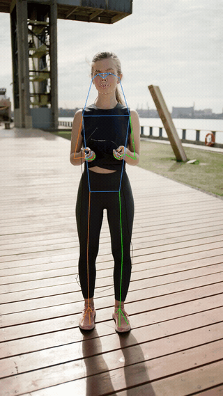
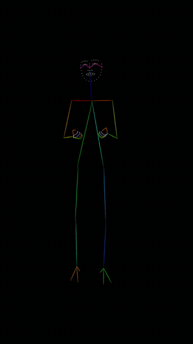

# Sapiens: 2D Human Pose Estimation

## Model Zoo
We provide 4 models of varying size. Sapiens-0.3B, Sapiens-0.6B, Sapiens-1B, Sapiens-2B.
In general, performance improves with increasing the model size.


### Body: 17 Keypoints
Best for general in-the-wild scenarios with body keypoints only, adhering to the [COCO keypoint format](http://presentations.cocodataset.org/COCO17-Keypoints-Overview.pdf).\
Please download the models from [hugging-face-pose](https://huggingface.co/noahcao/sapiens-pose-coco/tree/main/sapiens_host).

| Model         | Checkpoint Path
|---------------|--------------------------------------------------------------------------------------------------
| Sapiens-0.3B  | `$SAPIENS_CHECKPOINT_ROOT/pose/checkpoints/sapiens_0.3b/sapiens_0.3b_coco_best_coco_AP_796.pth`
| Sapiens-0.6B  | `$SAPIENS_CHECKPOINT_ROOT/pose/checkpoints/sapiens_0.6b/sapiens_0.6b_coco_best_coco_AP_812.pth`
| Sapiens-1B  | `$SAPIENS_CHECKPOINT_ROOT/pose/checkpoints/sapiens_1b/sapiens_1b_coco_best_coco_AP_821.pth`
| Sapiens-2B  | `$SAPIENS_CHECKPOINT_ROOT/pose/checkpoints/sapiens_2b/sapiens_2b_coco_best_coco_AP_822.pth`

### Body + Face + Hands + Feet: 133 Keypoints
Offers second-best generalization with body, face, hands, and feet keypoints, following the [COCO-WholeBody keypoint format](https://github.com/jin-s13/COCO-WholeBody).\
Please download the models from [hugging-face-pose](https://huggingface.co/noahcao/sapiens-pose-coco/tree/main/sapiens_host).

| Model         | Checkpoint Path
|---------------|--------------------------------------------------------------------------------------------------
| Sapiens-0.3B  | `$SAPIENS_CHECKPOINT_ROOT/pose/checkpoints/sapiens_0.3b/sapiens_0.3b_coco_wholebody_best_coco_wholebody_AP_620.pth`
| Sapiens-0.6B  | `$SAPIENS_CHECKPOINT_ROOT/pose/checkpoints/sapiens_0.6b/sapiens_0.6b_coco_wholebody_best_coco_wholebody_AP_695.pth`
| Sapiens-1B  | `$SAPIENS_CHECKPOINT_ROOT/pose/checkpoints/sapiens_1b/sapiens_1b_coco_wholebody_best_coco_wholebody_AP_727.pth`
| Sapiens-2B  | `$SAPIENS_CHECKPOINT_ROOT/pose/checkpoints/sapiens_2b/sapiens_2b_coco_wholebody_best_coco_wholebody_AP_745.pth`

### Body + Dense Face + Hands + Feet: 308 Keypoints
The highest number of keypoints predictor. Detailed 274 face keypoints. Following the [Sociopticon keypoint format](../pose/configs/_base_/datasets/goliath.py#L1512).
Please download the models from [hugging-face](https://huggingface.co/facebook/sapiens).

| Model         | Checkpoint Path
|---------------|--------------------------------------------------------------------------------------------------
| Sapiens-0.3B  | `$SAPIENS_CHECKPOINT_ROOT/pose/checkpoints/sapiens_0.3b/sapiens_0.3b_goliath_best_goliath_AP_575.pth`
| Sapiens-0.6B  | `$SAPIENS_CHECKPOINT_ROOT/pose/checkpoints/sapiens_0.6b/sapiens_0.6b_goliath_best_goliath_AP_600.pth`
| Sapiens-1B  | `$SAPIENS_CHECKPOINT_ROOT/pose/checkpoints/sapiens_1b/sapiens_1b_goliath_best_goliath_AP_640.pth`

## Inference Guide

Navigate to the script directory and launch the inference scripts for your desired keypoint configuration.

### Standard Estimation
- Navigate to your script directory:
  ```bash
  cd $SAPIENS_ROOT/pose/scripts/demo/local
  ```
- For 17 keypoints estimation (uncomment your model config line for inference):
  ```bash
  ./keypoints17.sh
  ```
- For 133 keypoints estimation (uncomment your model config line for inference):
  ```bash
  ./keypoints133.sh
  ```
- For 308 keypoints estimation (uncomment your model config line for inference, we recommend using face crops for better results!):
  ```bash
  ./keypoints308.sh
  ```
Define `INPUT` for your image directory and `OUTPUT` for results. Visualization and keypoints in JSON format are saved to `OUTPUT`. Customize `LINE_THICKNESS`, `RADIUS`, and `KPT_THRES` as needed. Adjust `JOBS_PER_GPU`, `TOTAL_GPUS` and `VALID_GPU_IDS` for multi-GPU configurations.

<p align="center">
  
  
  
</p>


### ControlNet Compatible Output
Generate OpenPose skeletons on a black background, compatible with ControlNet.
- Navigate to your script directory:
  ```bash
  cd $SAPIENS_ROOT/pose/scripts/demo/local
  ```
- For 17 keypoints estimation (uncomment your model config line for inference):
  ```bash
  ./keypoints17_openpose.sh
  ```
- For 133 keypoints estimation (uncomment your model config line for inference):
  ```bash
  ./keypoints133_openpose.sh
  ```

Customization options as mentioned above are applicable here as well.

<p align="center">
  
  
</p>
